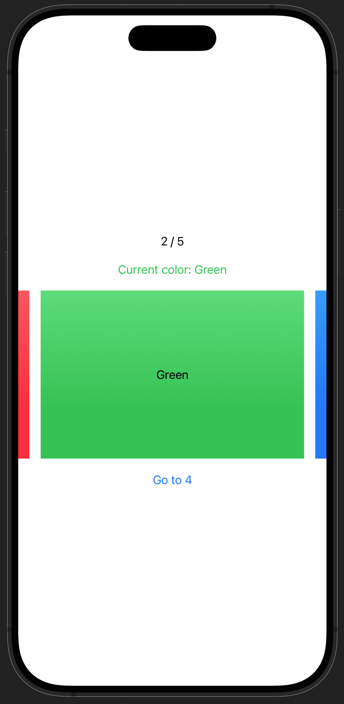
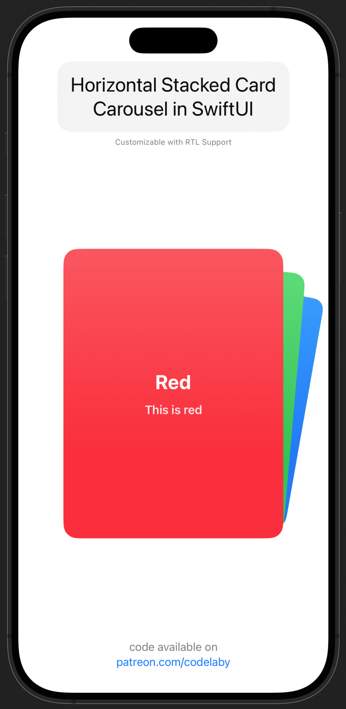

# MyRoadmaps
My code snippets for SwiftUI

<table>
<tr>
<td width="33.3%" align="center">

**Background Parallax** 

[Get Code](https://www.patreon.com/Codelaby/posts/background-in-110807529)

</td>
<td width="33.3%" align="center">

**Horizontal Parallax Card**

[Get Code](https://www.patreon.com/Codelaby/posts/card-parallax-in-115423537)

</td>
<td width="33.3%" align="center">

**Vertical Parallax**

[Get Code](https://www.patreon.com/Codelaby/posts/vertical-in-163345044)

</td>

</tr>

<tr>
<td width="33.3%" align="center">

**Base carousel** 

[Get Code](https://www.patreon.com/Codelaby/posts/build-horizontal-123339905)

</td>
<td width="33.3%" align="center">

**Horizontal Stacked Card** 

[Get Code](https://www.patreon.com/Codelaby/posts/scrollable-card-107938506)

</td>

</table>
