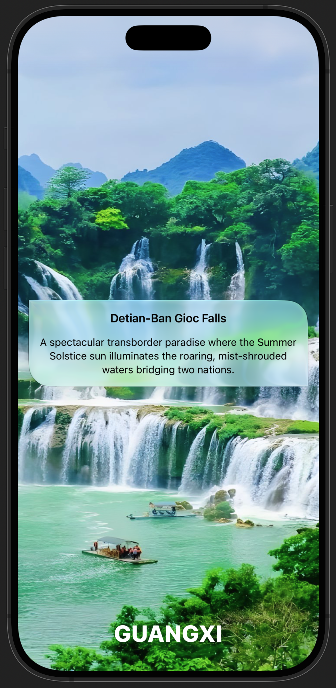
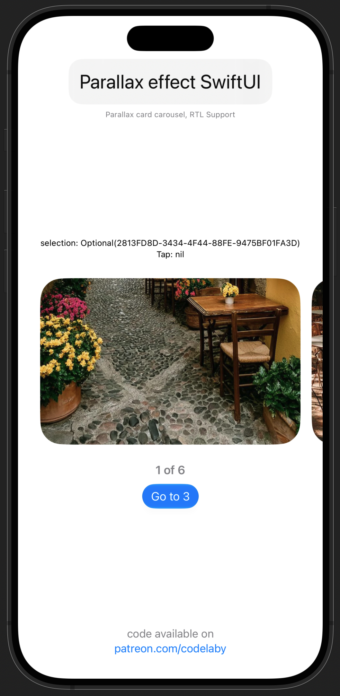
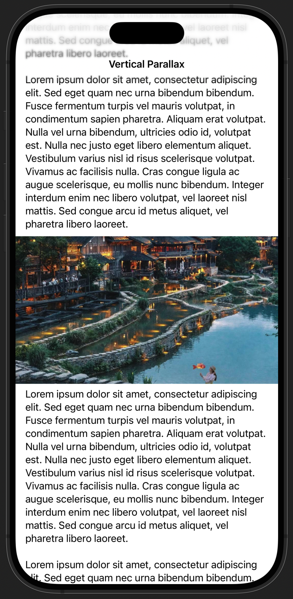

# MyRoadmaps
My code snippets for SwiftUI

<table>
<tr>
<td width="33%" align="center">

**Background Parallax** 

[Get Code](https://www.patreon.com/Codelaby/posts/background-in-110807529?utm_medium=clipboard_copy&utm_source=copyLink&utm_campaign=postshare_creator&utm_content=join_link)

</td>
<td width="33%" align="center">

**Horizontal Parallax Card**

[Get Code](https://www.patreon.com/Codelaby/posts/card-parallax-in-115423537?utm_medium=clipboard_copy&utm_source=copyLink&utm_campaign=postshare_creator&utm_content=join_link)

</td>
<td width="33%" align="center">

**Vertical Parallax**

[Get Code](https://www.patreon.com/Codelaby/posts/vertical-in-163345044?utm_medium=clipboard_copy&utm_source=copyLink&utm_campaign=postshare_creator&utm_content=join_link)

</td>
</tr>
