# MyRoadmaps
My code snippets for SwiftUI

<table>
<tr>
<td width="33.3%" align="center">

**Isometric 3D View**

[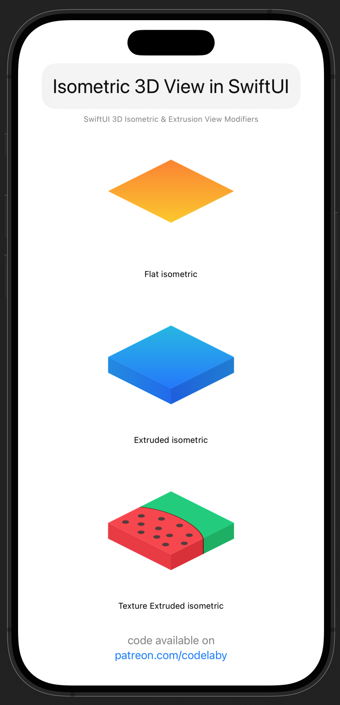](https://www.youtube.com/shorts/XF383n27dOc)

[Get Code](https://www.patreon.com/Codelaby/posts/isometric-view-165409708)

</td>

<td width="33.3%" align="center">

**QRCodeView**

[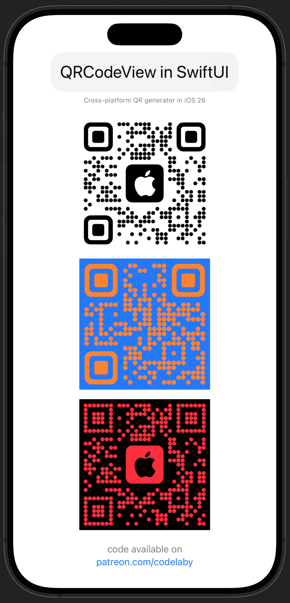](https://www.youtube.com/shorts/_iZ_s_DmaUY)

[Get Code](https://www.patreon.com/Codelaby/posts/native-rounded-165345991)

</td>

<td width="33.3%" align="center">

**Vertical Blinds ScrollViews**

[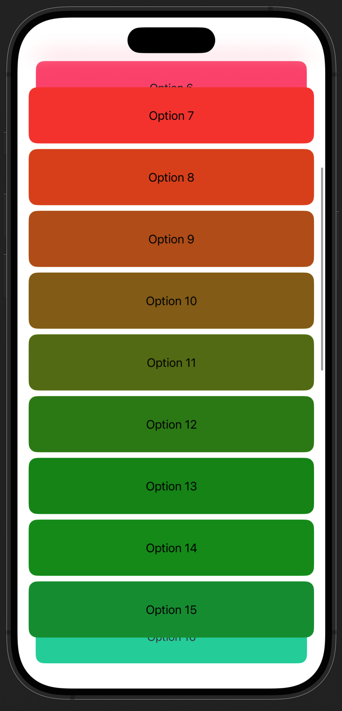](https://www.instagram.com/reel/DbYzafqBe22/)

[Get Code](https://www.patreon.com/Codelaby/posts/dynamic-blinds-126716753)

</td>

</tr>

<tr>
<td width="33.3%" align="center">

**Duotone Image Tint**

[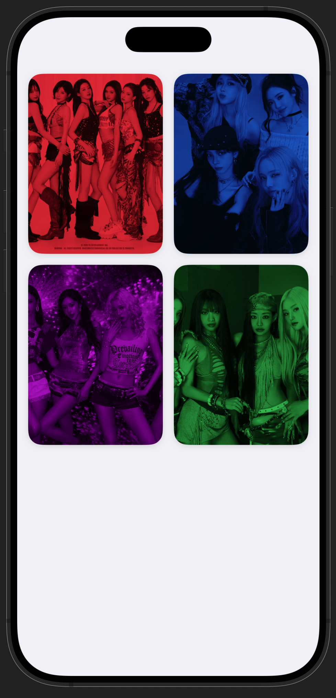](https://youtube.com/shorts/RlaL810gzPE)

[Get Code](https://www.patreon.com/Codelaby/posts/duotone-tinted-165169006)

</td>

<td width="33.3%" align="center">

**Flip View**

[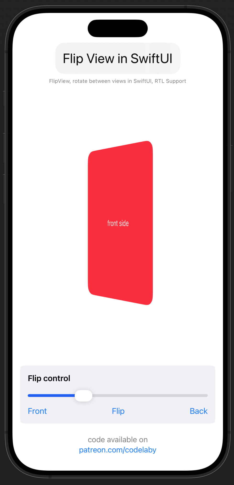](https://www.youtube.com/shorts/uwtEUWCWK3Q)

[Get Code](https://www.patreon.com/Codelaby/posts/flipview-turn-in-114165518)

</td>

<td width="33.3%" align="center">

**Circular Text Stamp**

[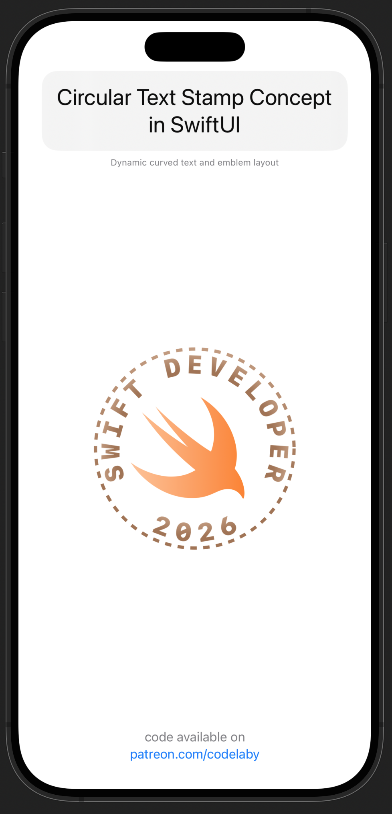](https://www.youtube.com/shorts/4z-MUNBTAf4)

[Get Code](https://www.patreon.com/Codelaby/posts/circular-text-in-164960102)

</td>

</tr>

<tr>
<td width="33.3%" align="center">

**Background Parallax**

[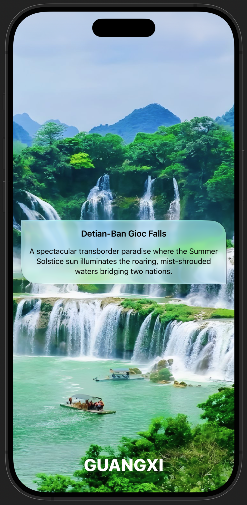](https://www.youtube.com/shorts/PYapV5zpgy4)

[Get Code](https://www.patreon.com/Codelaby/posts/background-in-110807529)

</td>

<td width="33.3%" align="center">

**Horizontal Parallax Card**

[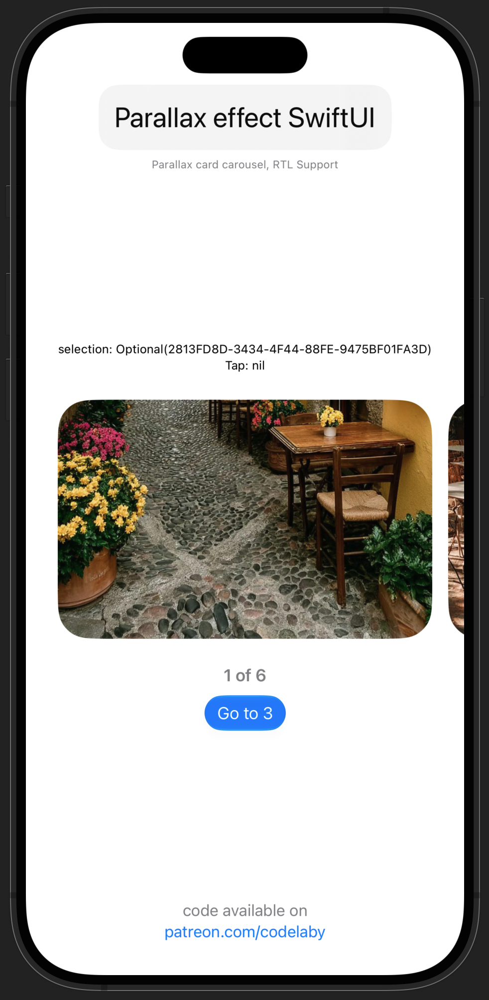](https://youtube.com/shorts/fOu5RkcuiZk)

[Get Code](https://www.patreon.com/Codelaby/posts/card-parallax-in-115423537)

</td>

<td width="33.3%" align="center">

**Vertical Parallax**

[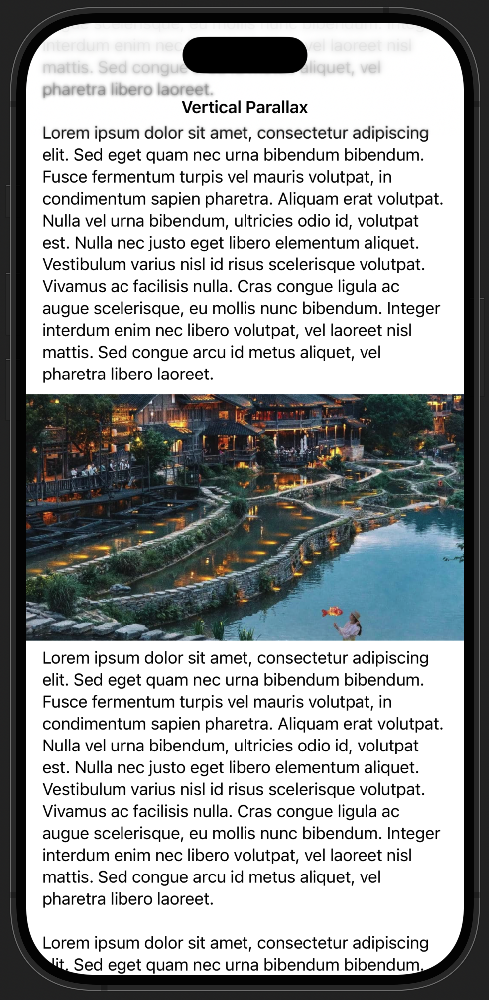](https://www.youtube.com/shorts/sXjTmhSDTCI)

[Get Code](https://www.patreon.com/Codelaby/posts/vertical-in-163345044)

</td>

</tr>

<tr>
<td width="33.3%" align="center">

**Base carousel**

[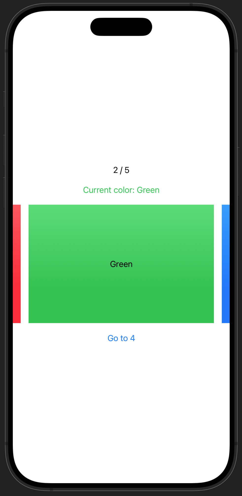](https://www.youtube.com/shorts/xRnlVvt6HHA)

[Get Code](https://www.patreon.com/Codelaby/posts/build-horizontal-123339905)

</td>

<td width="33.3%" align="center">

**Horizontal Stacked Card**

[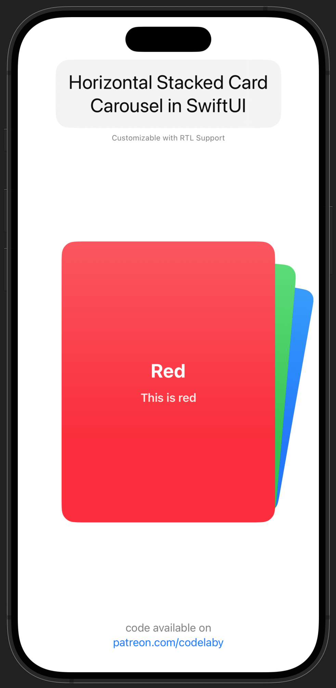](https://www.youtube.com/shorts/HQYgUVfknMo)

[Get Code](https://www.patreon.com/Codelaby/posts/scrollable-card-107938506)

</td>

<td width="33.3%" align="center">

**Safari-Style Tab Switcher**

[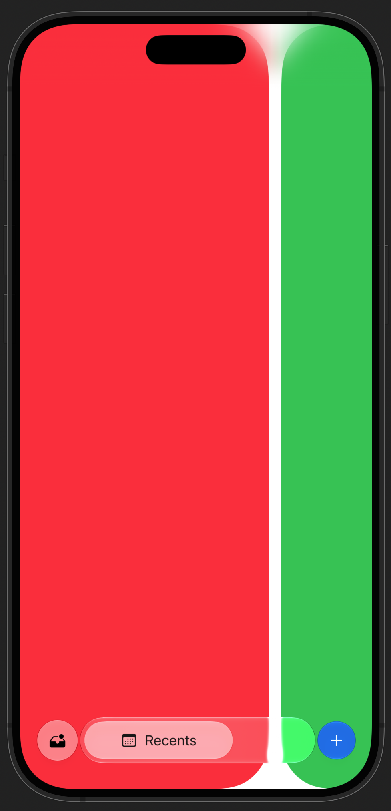](https://youtube.com/shorts/fe00Q7LGvYo)

[Get Code](https://www.patreon.com/Codelaby/posts/safari-style-tab-164614282)

</td>

</tr>

<tr>
<td width="33.3%" align="center">

**Swimming Activity Widget Concept**

[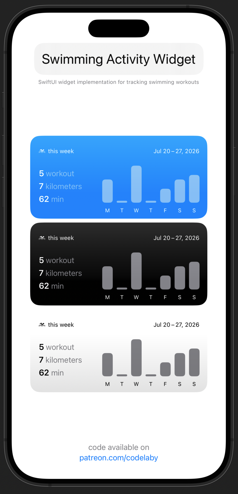](https://www.youtube.com/shorts/0ZZJifpzSdw)

[Get Code](https://www.patreon.com/Codelaby/posts/swimming-widget-164754201)

</td>

<td width="33.3%"></td>
<td width="33.3%"></td>
</tr>
</table>

