# MyRoadmaps
My code snippets for SwiftUI

<table>
<tr>
<td width="33.3%" align="center">

**Advertisement View**

[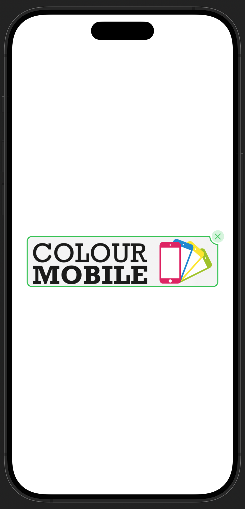](https://youtube.com/shorts/JxlutRq_zK4)

[Get Code](https://www.patreon.com/Codelaby/posts/custom-ad-banner-167847421)

</td>

<td width="33.3%" align="center">

**Leading Hero Carousel**

[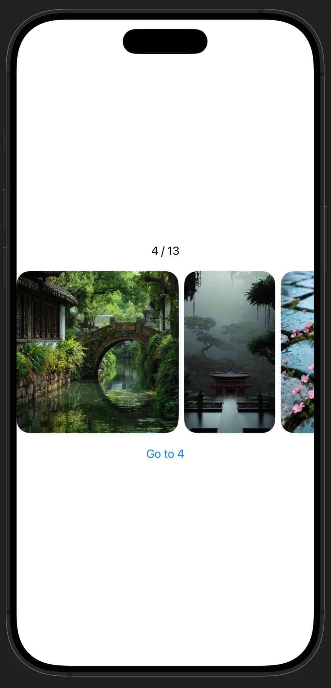](https://youtu.be/4iT700c3xX0)

[Get Code](https://www.patreon.com/Codelaby/posts/hero-carousel-115469157)

</td>

<td width="33.3%" align="center">

**Hero Carousel Centered**

[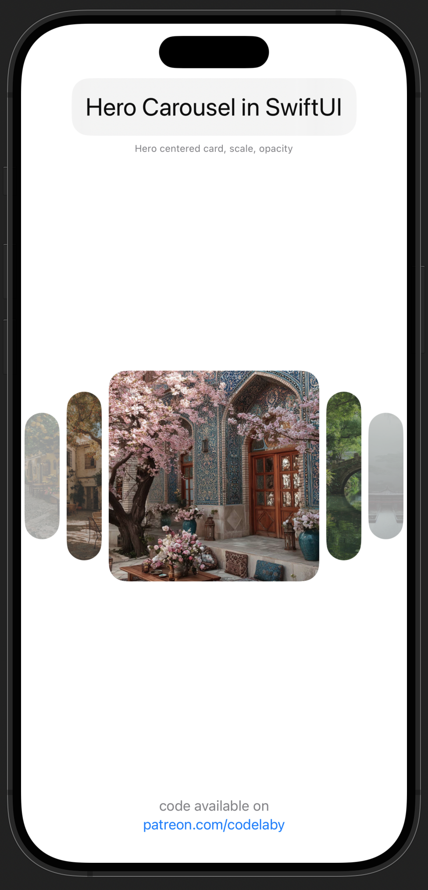](https://youtube.com/shorts/64R2bM7cm28)

[Get Code](https://www.patreon.com/Codelaby/posts/hero-carousel-115469157)

</td>

</tr>

<tr>
<td width="33.3%" align="center">

**Neon Glow Effect**

[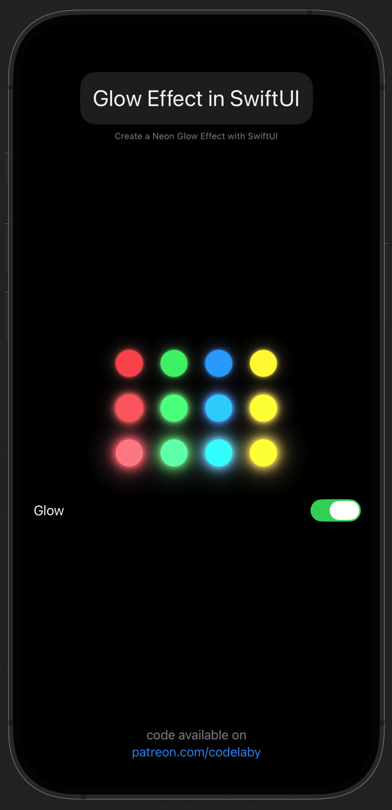](https://www.youtube.com/shorts/mL299gv5dDc)

[Get Code](https://www.patreon.com/Codelaby/posts/glow-effect-in-167627665)

</td>

<td width="33.3%" align="center">

**Multi Reorder Group**

[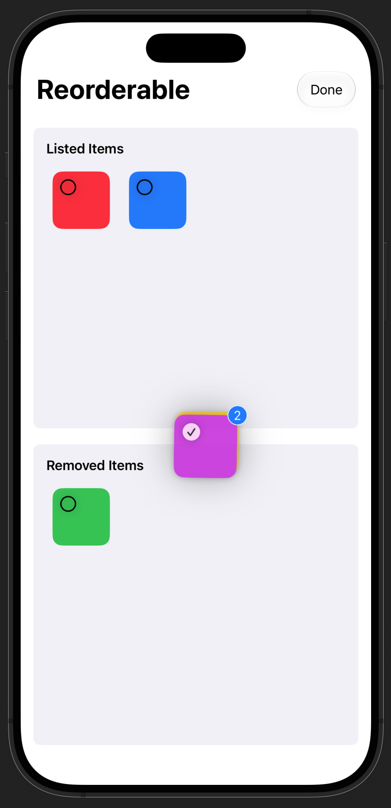](https://www.youtube.com/shorts/7Y6xBz1ZPq0)

[Get Code](https://www.patreon.com/Codelaby/posts/multi-item-in-167444503)

</td>

<td width="33.3%" align="center">

**Animated Success Burst**

[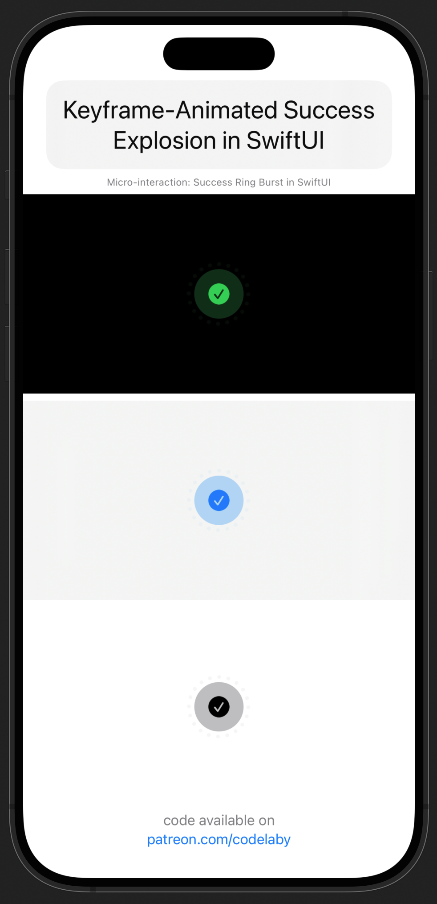](https://www.youtube.com/shorts/E_ncouCXYPk)

[Get Code](https://www.patreon.com/Codelaby/posts/animated-success-167392190)

</td>

</tr>

<tr>
<td width="33.3%" align="center">

**Dynamic Scroll Header**

[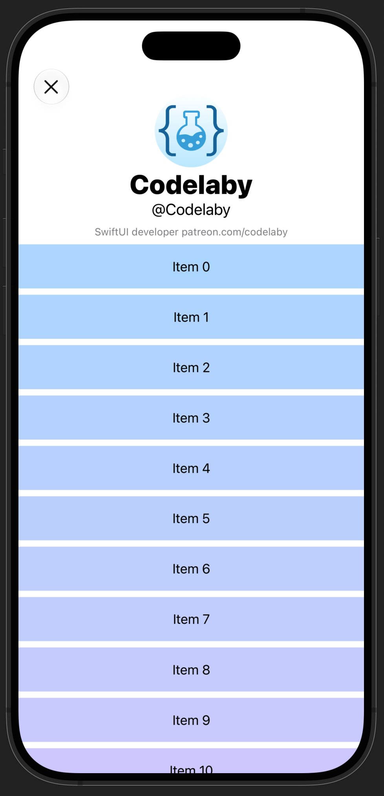](https://www.youtube.com/shorts/Pvaoc_owRMU)

[Get Code](https://www.patreon.com/Codelaby/posts/dynamic-header-167020076)

</td>

<td width="33.3%" align="center">

**Symbol Toggle Style**

[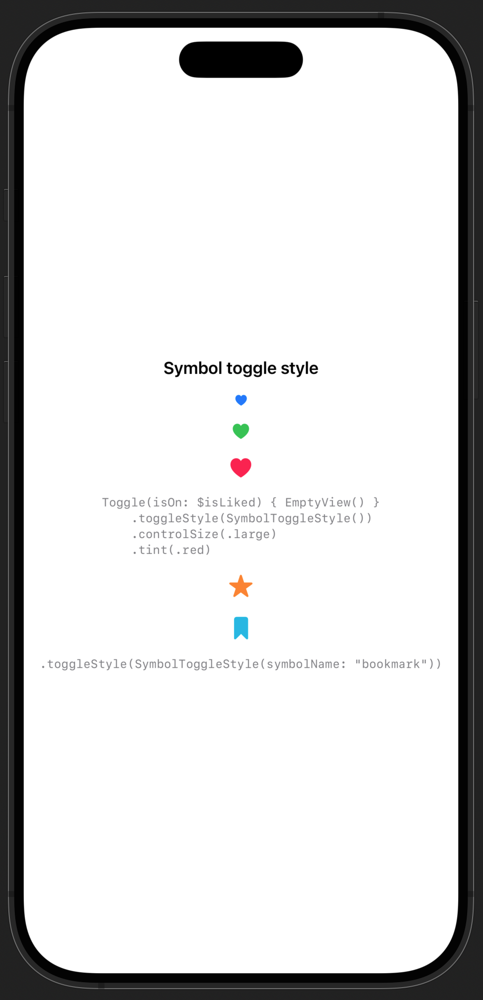](https://www.youtube.com/shorts/xGh3ZQ1L2VU)

[Get Code](https://www.patreon.com/Codelaby/posts/symboltogglestyl-166996505)

</td>

<td width="33.3%" align="center">

**Custom Prominent TabBar**

[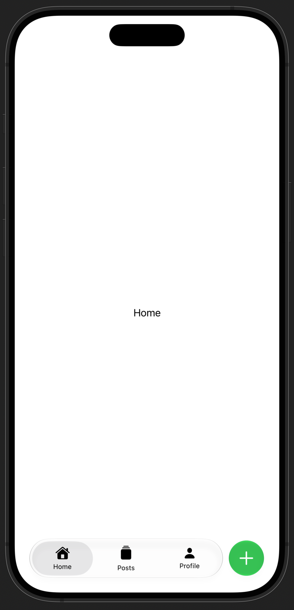](https://www.youtube.com/shorts/MkQ70b5O8aM)

[Get Code](https://www.patreon.com/Codelaby/posts/custom-prominent-166851448)

</td>

</tr>

<tr>
<td width="33.3%" align="center">

**Metallic colors**

[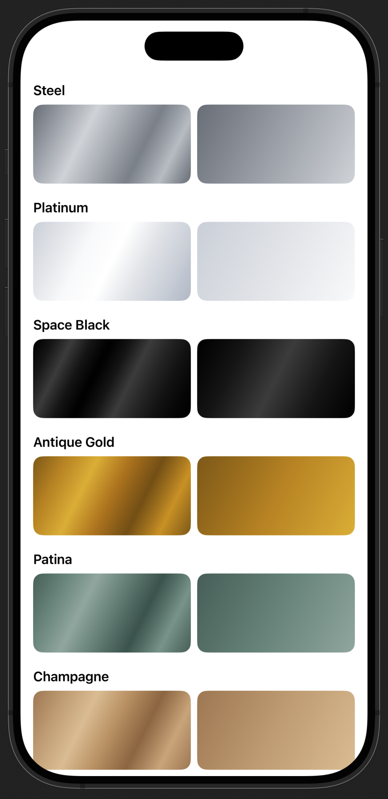](https://www.youtube.com/shorts/lmZ6M1rcRAg)

[Get Code](https://www.patreon.com/Codelaby/posts/metallic-colors-166408016)

</td>

<td width="33.3%" align="center">

**Rounded Ribbon**

[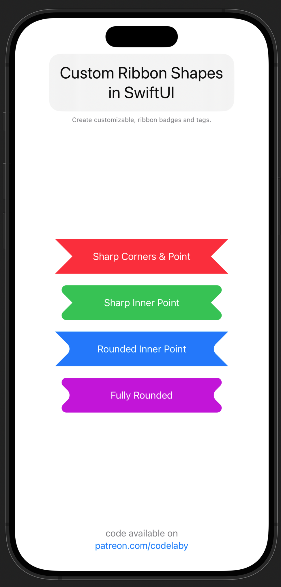](https://www.youtube.com/shorts/Q_vTdmVtqCQ)

[Get Code](https://www.patreon.com/Codelaby/posts/rounded-ribbon-166178665)

</td>

<td width="33.3%" align="center">

**Tier graph**

[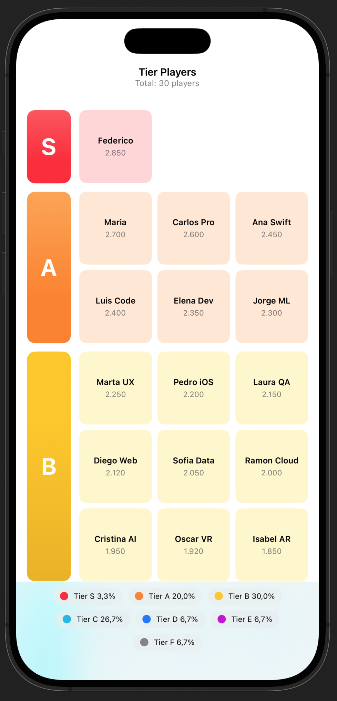](https://youtube.com/shorts/1VlcBFPv34Y)

[Get Code](https://www.patreon.com/Codelaby/posts/tiergraphview-165623414)

</td>

</tr>

<tr>
<td width="33.3%" align="center">

**Get Screen Corner Radius**

[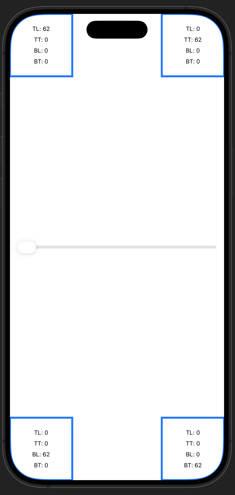](https://youtube.com/shorts/4ZpNcbPWenE)

[Get Code](https://www.patreon.com/Codelaby/posts/getting-device-127422000)

</td>

<td width="33.3%" align="center">

**Day Week Picker**

[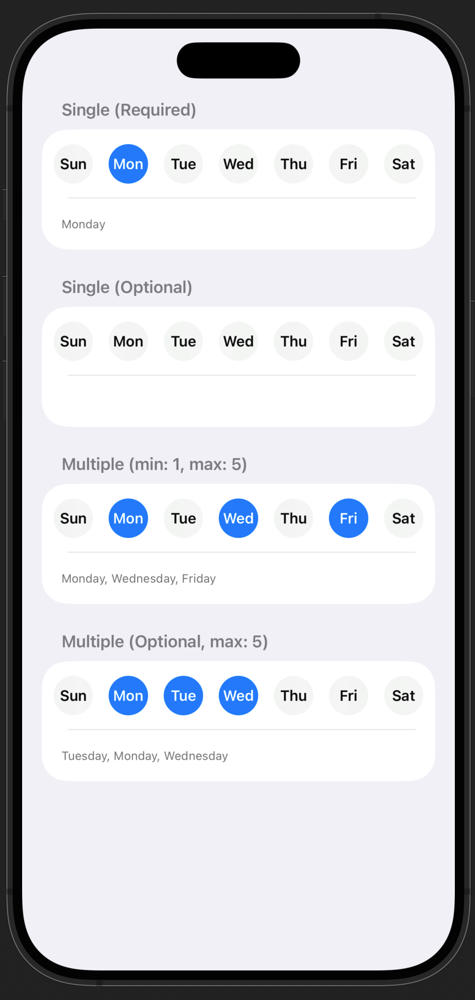](https://www.youtube.com/shorts/gDgCKKafH5k)

[Get Code](https://www.patreon.com/Codelaby/posts/semantic-day-in-113144033)

</td>

<td width="33.3%" align="center">

**Apple Translation Language Picker**

[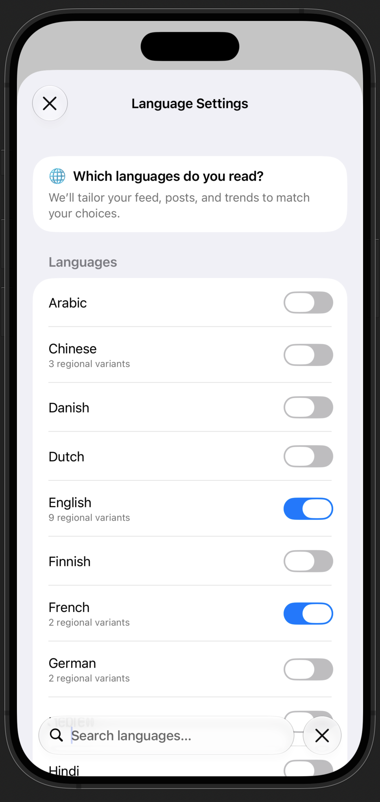](https://youtube.com/shorts/_4YKekKnlss)

[Get Code](https://www.patreon.com/Codelaby/posts/swiftui-apple-165466134)

</td>

</tr>

<tr>
<td width="33.3%" align="center">

**Isometric 3D View**

[Get Code](https://www.patreon.com/Codelaby/posts/isometric-view-165409708)

</td>

<td width="33.3%" align="center">

**QRCodeView**

[Get Code](https://www.patreon.com/Codelaby/posts/native-rounded-165345991)

</td>

<td width="33.3%" align="center">

**Vertical Blinds ScrollViews**

[Get Code](https://www.patreon.com/Codelaby/posts/dynamic-blinds-126716753)

</td>

</tr>

<tr>
<td width="33.3%" align="center">

**Duotone Image Tint**

[Get Code](https://www.patreon.com/Codelaby/posts/duotone-tinted-165169006)

</td>

<td width="33.3%" align="center">

**Flip View**

[Get Code](https://www.patreon.com/Codelaby/posts/flipview-turn-in-114165518)

</td>

<td width="33.3%" align="center">

**Circular Text Stamp**

[Get Code](https://www.patreon.com/Codelaby/posts/circular-text-in-164960102)

</td>

</tr>

<tr>
<td width="33.3%" align="center">

**Background Parallax**

[Get Code](https://www.patreon.com/Codelaby/posts/background-in-110807529)

</td>

<td width="33.3%" align="center">

**Horizontal Parallax Card**

[Get Code](https://www.patreon.com/Codelaby/posts/card-parallax-in-115423537)

</td>

<td width="33.3%" align="center">

**Vertical Parallax**

[Get Code](https://www.patreon.com/Codelaby/posts/vertical-in-163345044)

</td>

</tr>

<tr>
<td width="33.3%" align="center">

**Base carousel**

[Get Code](https://www.patreon.com/Codelaby/posts/build-horizontal-123339905)

</td>

<td width="33.3%" align="center">

**Horizontal Stacked Card**

[Get Code](https://www.patreon.com/Codelaby/posts/scrollable-card-107938506)

</td>

<td width="33.3%" align="center">

**Safari-Style Tab Switcher**

[Get Code](https://www.patreon.com/Codelaby/posts/safari-style-tab-164614282)

</td>

</tr>

<tr>
<td width="33.3%" align="center">

**Swimming Activity Widget Concept**

[Get Code](https://www.patreon.com/Codelaby/posts/swimming-widget-164754201)

</td>

<td width="33.3%"></td>
<td width="33.3%"></td>
</tr>
</table>
